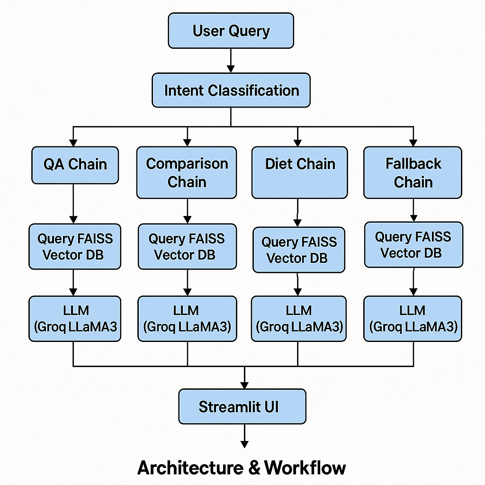
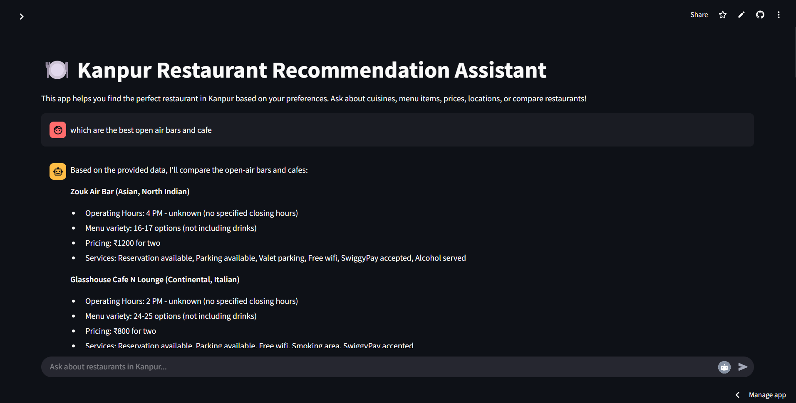

# 🍽️ Restaurant Data Scraper & RAG-based Chatbot

This project is focused on building a restaurant-aware AI chatbot for **Kanpur**. It integrates **web scraping**, **OCR**, **RAG-based LLM inference**, **intent classification**, and a sleek **Streamlit UI** to answer natural language queries about food and restaurants using real-time menu data from **Zomato** and **Swiggy**.

---

## 🚀 Features

- 📄 Scrapes restaurant data from **Zomato** and **Swiggy** (for Kanpur) using **Selenium**
- 🧾 Extracts text from menu images using **OCR (Tesseract)**
- 🧠 Implements a **RAG (Retrieval-Augmented Generation)** chatbot using:
  - **FAISS** vector store
  - **Hugging Face** embeddings
  - **Groq's LLaMA3-8B** model
- 💬 Supports **intent classification** for:
  - Restaurant QA
  - Comparison
  - Dietary preferences
  - Fallback queries
- 🧪 Experimented in `rag.ipynb`, final app in `rag.py`
- 🧑‍💻 Built with **Streamlit** and deployed
- 🔀 Logic routing based on detected user intent

---

Demo Video Link: https://drive.google.com/file/d/10fKT8UB_VAoHdFuTQ4_N4KXZ0JB0oAOz/view?usp=sharing
Deployed App Link: https://zta3nurmcthvctmvaaedjv.streamlit.app/

## 📊 Data Collection & Preprocessing

- Data scraped using `Selenium` from:
  - **Zomato**: 10 restaurants → stored in `restaurants.csv`
  - **Swiggy**: 90 restaurants → stored in `restaurants_swiggy.csv`

- Columns in each CSV:
  - `Restaurant Name`, `Location`, `Contact`, `Menu`, `Cuisine`, `Price`, `"Ratings(Dining, Delivery)"`, `Operating Hours`, `More Info`

- Merged the two CSVs → `merged.csv`

- **Menu column** contains image links.
  - Used **OCR** to extract text from menu images.
  - Extracted menu text is stored in a new column: `menu_text`
  - OCR code available in `rag.ipynb`

---

## 🔧 Files Overview

| File                         | Purpose                                            |
|------------------------------|----------------------------------------------------|
| `Restaurants_scraper.py`     | Zomato data scraper using Selenium                |
| `Restaurants_scraper_swiggy.py` | Swiggy data scraper using Selenium             |
| `rag.ipynb`                  | OCR pipeline + VectorStore creation + testing     |
| `rag.py`                     | Final RAG logic + chatbot interface               |
| `app.py`                     | Streamlit App file                                |
| `merged.csv`                 | Combined & preprocessed data (with OCR text)      |

---

## 🧠 Architecture & Workflow




## 🛠 Technologies Used

| Task                        | Tool/Library                       |
|-----------------------------|------------------------------------|
| Web Scraping                | Selenium                           |
| OCR                         | Tesseract, `pytesseract`           |
| Embeddings                  | `HuggingFaceEmbeddings`            |
| Vector DB                   | FAISS                              |
| LLM Inference               | LangChain, Groq, LLaMA3-8B         |
| App Framework               | Streamlit                          |
| Prompt Engineering & RAG   | LangChain                          |
| CSV Parsing & Merging      | `pandas`                           |

markdown
Copy code
# 🍽️ Zomato RAG Chatbot

A conversational assistant to help you find restaurants, compare menus, and get dietary suggestions — powered by **LangChain**, **Streamlit**, and **Groq's LLaMA3-8B**.

## 🗂 Project Structure

```
📁 RAG/
├── merged_data.csv        # Combined restaurant data with menu text
├── rag.py            # Final Streamlit app
├── rag.ipynb         # Development notebook
├── .env              # Optional Groq API keys
├── requirements.txt
└── README.md
```


## 💡 Intent Routing Logic

The chatbot supports 4 types of queries, identified using keyword-based classification:

- **qa**:  
  _Examples_:  
  - "What are some Chinese restaurants?"  
  - "Show me options near IIT"

- **comparison**:  
  _Examples_:  
  - "Compare KFC and Burger King"  
  - "Which is cheaper?"

- **diet**:  
  _Examples_:  
  - "Suggest vegan dishes"  
  - "I want low-calorie meals"

- **fallback**:  
  Used for unclear or out-of-scope queries

Each query is routed to a separate **LangChain pipeline** using a **stuff chain** with custom prompt templates.

---

## 🖥️ Running the App Locally

### 1. Clone the Repository

```bash
git clone https://github.com/Shivang004/RAG.git
cd RAG
```
### 2. Install Requirements
```bash
pip install -r requirements.txt
```

### 3. Setup Environment
Add your GROQ API key to a .env file:

```bash
echo "GROQ_API_KEY=your_groq_api_key_here" > .env
```

### 4. Run the App
```bash
streamlit run rag.py
```
The app will open in your browser at http://localhost:8501

### ✨ Features
- 💬 Natural language chat interface
-  Intent Classification
-  Maintains Chat history and gives results based on it
- ⚖️ Restaurant comparison tool
- 🥗 Smart dietary recommendations (vegan, low-calorie, etc.)
- ⚡ Fast, efficient responses using RAG + LLaMA3-8B
- Fallback mechanism to handle out of domain questions

### 🖼 App Screenshot




### 🤝 Credits
Built with ❤️ by Shivang

